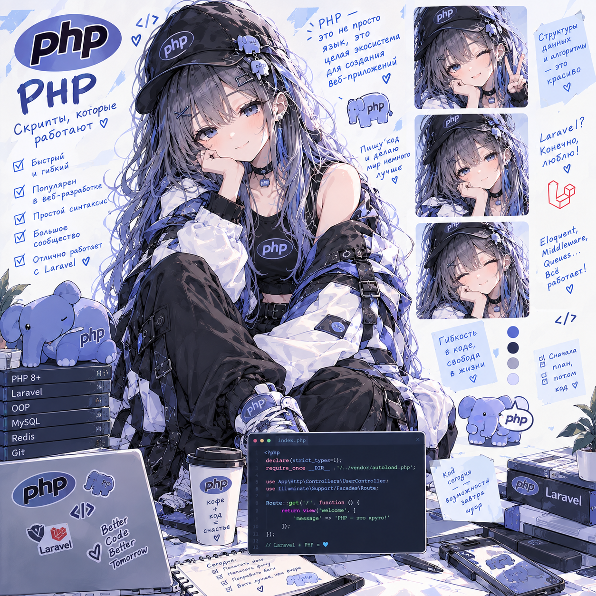

# Чистый PHP Lab

> **24.09.2026 — методичка вычитана и исправлена.** Что найдено и что поправлено — в [fixes/php.md](https://github.com/meeymirita/submodule-group-lab/blob/main/fixes/php.md) сборного репозитория.

Чистый PHP 8.4 с нуля: то, что обычно прячет Laravel — автозагрузка,
свой роутер, свой DI-контейнер, PDO напрямую, сессии/CSRF руками. Домен —
та же кофейня, что в OOP-лабе, но здесь пишется инфраструктура, которую
там давал фреймворк.

**Формат:** методичка [`PHP_Lab_VanillaCoffee.html`](PHP_Lab_VanillaCoffee.html) — готова, прохождение впереди.

**Что внутри:**
- Разделы 1–12 — теория языка и рантайма: типы и приведение, `strict_types`,
  массивы как значения с copy-on-write, строки и multibyte, суперглобалы,
  исключения, замыкания и генераторы, магические методы, `match`/nullsafe,
  Composer и автозагрузка (PSR-4).
- Раздел 13 — восемь сессий практики: язык (сессии 1–4) → инфраструктура
  своими руками — роутер, DI-контейнер, PDO, сессии/CSRF (сессии 5–7) →
  финал: REST API на кофейне и сравнение с Laravel (сессия 8).
- Разделы 14–17 — чек-лист концепций, глоссарий, вопросы для собеседования,
  что дальше.

**Стек:** PHP 8.4 CLI, встроенный dev-сервер, PostgreSQL через голый PDO,
Composer только для автозагрузки — без единого стороннего пакета до
сессии 7 (где нужен `pdo_pgsql`).

Часть сборного репозитория лабораторных работ — [submodule-group-lab](https://github.com/meeymirita/submodule-group-lab).
